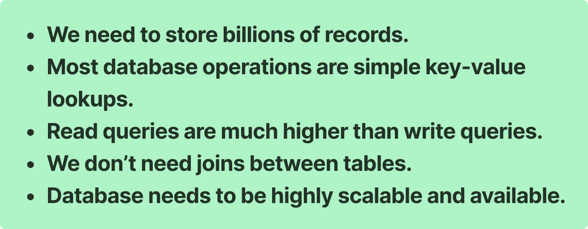
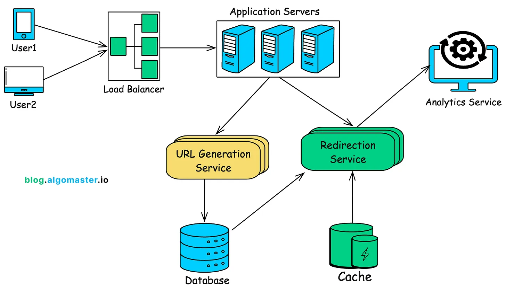

Design a shorten URL service 
## Requirements 
You are given a Long URL -> You should be able to generate a short URL from that.              
Item 1 ) Short URL should be unique                                
Item 2) Redirect User to Long URL when short URL is searched.                      
Item 3) After a timeFrame URL should Not be accessible              
Allow users to customize their short URLs (optional)                         
Provide analytics on link usage (optional)                           

### Others ->
High availability  
Low Latency (Response time should be quicker)       
Scalability (the system should handle millions of requests per day)               
Durability (shortened URLs should work for years)                            
security 

Traffic Calculation and the                               
Let’s assume the following traffic characteristics:                   
 
Daily URL Shortening Requests: 1 million requests per day = 1,000,000                       
Read:Write ratio: 100:1 (for every URL creation, we expect 100 redirects)                      
Peak Traffic: 10x the average load                         
URL Lengths: Average original URL length of 100 characters                                    

### Calculate capacity Estimation
#### 1) Throughput  Requirements (Number of requests per second)
    Average writes per second - 1,000,000/86400=     12request/second -> ka load handler
    Peak time -> 12*10 -> 120 request Per second
  Since Read:Write ratio is 100:1                                              
    Average redirects per second = 12*100 = 1200                       
    Peak time redirects = 12*100*10  = 12000RPS                    
  #### 2) Storage Calculation  Bytes
   Current URL - 100 Bytes                                   
   creation TimeStamp - 8 bytes                         
   Expiry TimeStamp - 8bytes                                    
   Shorten URL - 7 bytes (Base64)                                       
   Click Count: 4 bytes (integer) - Need to understand this                              
 Total Storage Bytes = 100+8+8+7+4 = 127 bytes                         
 Storage requirement for a year                                                
 Total URLs per year = 1,000,000 * 365 = 365,000,000;                                  
 Total Storage per year = 365,000,000*127 =  46.4 GB                                            
   #### 3) Bandwidth capacity
   Assuming the HTTP 301 redirect response size is about 500 bytes (includes headers and the short URL).                      
   Total Read bandwidth Per day = 1,000,000*500bytes = 5*10^8 =>                                
   Peak                                                                         
   #### 4) Caching Estimation -> We will be caching only HOT URLs
   read-heavy system - caching will reduce the latency of application.                                    
   80-20 rule (for hot URLS only we need caching ) = can cache 20% hot URLs in local cache.                     
   Since we have 1 million writes per day, if we only cache 20% of the hot urls in a day,                        
   Total cache memory required = 1M * 0.2 * 127 Bytes = 25.4 M                                           
   We can miss 10% of the cache hits -> so                                        

#### 5) Infrastructure Sizing 
   1) API servers - Start with 4-6 instances of behind a load balancer with each handling requests from 200-300RPS 
   2) Databases - A distributed database with 10-20 nodes to handle both storage and high read/write throughput.
   3) Cache Layer - A distributed cache with 3-4 nodes, depending on the load and cache hit ratio.

URL Generation Service: Generates short URLs, handles custom aliases, and manages link expirations.          
Redirection Service: Redirects the users to the original URL.                                      
Database: Stores mappings between short URLs and long URLs.                                       
Cache : Stores frequently accessed URL mappings for faster retrieval.                               

### DATABASE Selection 

From the above point we need a database that store millions of records and stores lookup data not in table format. 
So, NoSQL database like cassendra or dynamoDB will be best choice. that provide high scalability and availability
https://blog.algomaster.io/p/design-a-url-shortener
#### Let's Decide the Database Schema - > 
User Info and URL Mappings                                                    
UserINFO (user ID, Username, UserEmailID, Password)                                  
URLMappings(OldURL, New URL, createdAtTimestamp, expirationTimeStamp,UserId,CLickCount)                  

### API Design 
API Shorten URL Creation                        
POST                                                
` Request - > 
{ 
longURL:"https://this.com/ajsdo/9093b/jzhdgfi/s23/23"
customURL:""
expiryTimeStamp = "", 
user_ID = user123
}`
Response
`{
longURL:"https://this.com/ajsdo/9093b/jzhdgfi/s23/23"
tinyURL:"this.com"
expiryTimeStamp = "",
createdTimeStamp = ""
user_ID = ""
}`
API ShortURL Redirection                                       
Endpoint: GET /{short_url_key}                                            
This endpoint redirects the user to the original long URL.                                  
Response                                                                     
Sample Response:                                                                                 
HTTP/1.1 301 Moved Permanently Location: https://www.example.com/some/very/long/url 

### Deep Dive into Key Components
#### URL Generator Service 
URL should be as short as possible but should handle the unique Possibility 
Collision handling should be there ->For the same URL there should not be new generators 

Approach 1
User submits a request to generate short url for the long url: https://www.example.com/some/very/long/url/that/needs/to/be/shortened

Generate an MD5 hash of the long URL. MD5 produces a 128-bit hash, typically a 32-character hexadecimal string: 1b3aabf5266b0f178f52e45f4bb430eb

Instead of encoding the entire 128-bit hash, we typically use a portion of the hash (e.g., the first few bytes) to create a more manageable short URL.

First 6 bytes of the hash: 1b3aabf5266b

Convert these bytes to decimal: 1b3aabf5266b (hexadecimal) → 47770830013755 (decimal)

Encode the result into a Base62 encoded string: DZFbb43

Other possible approaches will come once I will start Implementing
Caching I can use - 
in-memory store like Redis. 

ANalytical Logs
If the service needs to track analytics, such as the number of times a short URL is clicked, a separate analytics service can be introduced:

Event Logging: Use a message queue (e.g., Kafka) to log each click event. This decouples the analytics from the core redirection service, ensuring that it doesn’t introduce latency.

Batch Processing: Process logs in batches for aggregation and storage in a data warehouse for later analysis. 

2.4 Caching Estimation
 Read Heavy Application 

